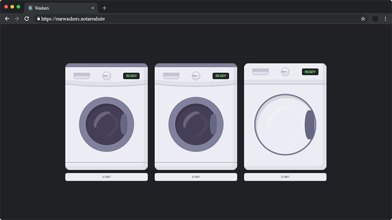

<a name="readme-top"></a>

[![Contributors][contributors-shield]][contributors-url]
[![Forks][forks-shield]][forks-url]
[![Stargazers][stars-shield]][stars-url]
[![Issues][issues-shield]][issues-url]
[![MIT License][license-shield]][license-url]
[![LinkedIn][linkedin-shield]][linkedin-url]


<br />
<div align="center">
  <a href="https://github.com/alexandrosmagos/shared-washers">
    
  </a>

<h3 align="center">Shared Washers</h3>

  <p align="center">
    A simple solution to shared washing machines & dryer in a building
    <br />
    <a href="https://github.com/alexandrosmagos/shared-washers/issues">Report Bug</a>
    ·
    <a href="https://github.com/alexandrosmagos/shared-washers/issues">Request Feature</a>
  </p>
</div>


<details>
  <summary>Table of Contents</summary>
  <ol>
    <li>
      <a href="#about-the-project">About The Project</a>
      <ul>
        <li><a href="#built-with">Built With</a></li>
        <li><a href="#libraries-used">Libraries Used</a></li>
      </ul>
    </li>
    <li>
      <a href="#getting-started">Getting Started</a>
      <ul>
        <li><a href="#prerequisites">Prerequisites</a></li>
        <li><a href="#installation">Installation</a></li>
      </ul>
    </li>
    <li><a href="#usage">Usage</a></li>
    <li><a href="#roadmap">Roadmap</a></li>
    <li><a href="#contributing">Contributing</a></li>
    <li><a href="#license">License</a></li>
    <li><a href="#acknowledgments">Acknowledgments</a></li>
  </ol>
</details>


## About The Project

I currently live on the third floor of a three-story building with eleven other apartments/people. One of the drawbacks of living on the top floor is having to walk down four flights of stairs for a load, only to discover that the washing machines are in use, and then having to go back and repeat the process several times.

<p align="right">(<a href="#readme-top">back to top</a>)</p>


### Built With

* [![Bootstrap][Bootstrap.com]][Bootstrap-url]
* [![NodeJS][Nodejs.com]][Nodejs-url]

<p align="right">(<a href="#readme-top">back to top</a>)</p>


### Libraries Used

* [![Express][Express.com]][Express-url]
* [![EJS][EJS.com]][EJS-url]
* [![fs][fs.com]][fs-url]
* [![quick.db][quickdb.com]][quickdb-url]
* [![socket.io][socket.io]][socket.io-url]


<p align="right">(<a href="#readme-top">back to top</a>)</p>


## Getting Started

This is an example of how you may give instructions on setting up your project locally.
To get a local copy up and running follow these simple example steps.

### Prerequisites

This is an example of how to list things you need to use the software and how to install them.
* Node.js and npm
  ```sh
  https://docs.npmjs.com/downloading-and-installing-node-js-and-npm
  ```

### Installation

1. Clone the repo
   ```sh
   git clone https://github.com/alexandrosmagos/shared-washers.git
   ```
2. Install NPM packages
   ```sh
   npm install
   ```

<p align="right">(<a href="#readme-top">back to top</a>)</p>


## Usage

The app's goal was to be simple. On the initial load of the website, you will see the status of the machines in real time. Starting or Stopping a machine will also update other people's screens in real time.

<p align="right">(<a href="#readme-top">back to top</a>)</p>


## Roadmap

- [x] Two washing machines and one Dryer
- [x] Start / Stop Functionality
- [x] Time passed timer in format MM:SS while <60 minutes, else HH:MM
    - [ ] If time passed > 24h, format something like 2D 5H
- [ ] Implement 4 number pin code with sessions

See the [open issues](https://github.com/alexandrosmagos/shared-washers/issues) for a full list of proposed features (and known issues).

<p align="right">(<a href="#readme-top">back to top</a>)</p>


## Contributing

Contributions are what make the open source community such an amazing place to learn, inspire, and create. Any contributions you make are **greatly appreciated**.

If you have a suggestion that would make this better, please fork the repo and create a pull request. You can also simply open an issue with the tag "enhancement".
Don't forget to give the project a star! Thanks again!

1. Fork the Project
2. Create your Feature Branch (`git checkout -b feature/AmazingFeature`)
3. Commit your Changes (`git commit -m 'Add some AmazingFeature'`)
4. Push to the Branch (`git push origin feature/AmazingFeature`)
5. Open a Pull Request

<p align="right">(<a href="#readme-top">back to top</a>)</p>


## License

Distributed under the GPL-3.0 License. See `LICENSE.txt` for more information.

<p align="right">(<a href="#readme-top">back to top</a>)</p>


## Acknowledgments

* [Project Icon from flaticon](https://www.flaticon.com/free-icon/washing-machine_2283894?related_id=2283894&origin=tag)
* [Washing machines are designed by Arkellys on Codepen](https://codepen.io/Arkellys/details/YoYNve)

<p align="right">(<a href="#readme-top">back to top</a>)</p>


[contributors-shield]: https://img.shields.io/github/contributors/alexandrosmagos/shared-washers.svg?style=for-the-badge
[contributors-url]: https://github.com/alexandrosmagos/shared-washers/graphs/contributors
[forks-shield]: https://img.shields.io/github/forks/alexandrosmagos/shared-washers.svg?style=for-the-badge
[forks-url]: https://github.com/alexandrosmagos/shared-washers/network/members
[stars-shield]: https://img.shields.io/github/stars/alexandrosmagos/shared-washers.svg?style=for-the-badge
[stars-url]: https://github.com/alexandrosmagos/shared-washers/stargazers
[issues-shield]: https://img.shields.io/github/issues/alexandrosmagos/shared-washers.svg?style=for-the-badge
[issues-url]: https://github.com/alexandrosmagos/shared-washers/issues
[license-shield]: https://img.shields.io/github/license/alexandrosmagos/shared-washers.svg?style=for-the-badge
[license-url]: https://github.com/alexandrosmagos/shared-washers/blob/master/LICENSE.txt
[linkedin-shield]: https://img.shields.io/badge/-LinkedIn-black.svg?style=for-the-badge&logo=linkedin&colorB=555
[linkedin-url]: https://www.linkedin.com/in/alexandrosmagos/
[product-screenshot]: readme/window1.png
[Nodejs.com]: https://img.shields.io/badge/Node.js-43853D?style=for-the-badge&logo=node.js&logoColor=white
[Nodejs-url]: https://nodejs.org/en/
[Bootstrap.com]: https://img.shields.io/badge/Bootstrap-563D7C?style=for-the-badge&logo=bootstrap&logoColor=white
[Bootstrap-url]: https://getbootstrap.com/
[Express.com]: https://img.shields.io/badge/Express.js-404D59?style=for-the-badge
[Express-url]: https://expressjs.com/
[Socket.io]: https://img.shields.io/badge/Socket.io-010101?style=for-the-badge&logo=socket.io&logoColor=white
[Socket.io-url]: https://socket.io/
[quickdb.com]: https://img.shields.io/badge/quick.db-2ECC71?style=for-the-badge&logo=quick.db&logoColor=white
[quickdb-url]: https://quickdb.js.org/
[quickdb.com]: https://img.shields.io/badge/quick.db-2ECC71?style=for-the-badge&logo=quick.db&logoColor=white
[quickdb-url]: https://quickdb.js.org/
[ejs.com]: https://img.shields.io/badge/EJS-9B59B6?style=for-the-badge&logo=ejs&logoColor=white
[ejs-url]: https://ejs.co/
[fs.com]: https://img.shields.io/badge/FS-000000?style=for-the-badge&logo=fs&logoColor=white
[fs-url]: https://nodejs.org/api/fs.html